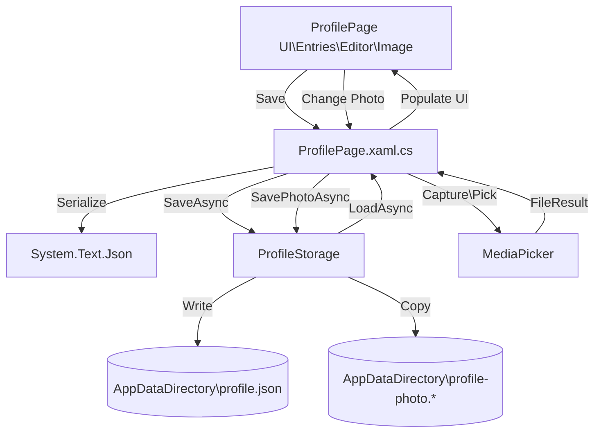
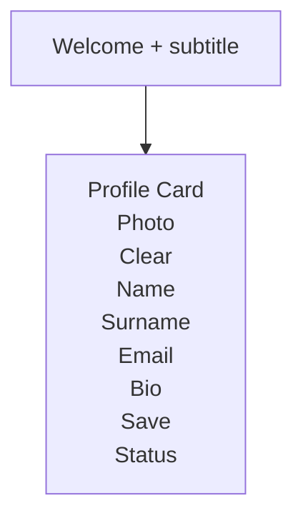

# Ass5 (LocalStorage)

.NET MAUI app that lets a user create and store a simple profile (name, surname, email, bio) and an optional profile photo using local app storage.

## Features

- View/edit profile fields: **Name**, **Surname**, **Email Address**, **Bio**
- Pick a profile photo from the device or capture a new one (where supported)
- Save/load profile data to local storage as JSON
- Save a profile photo to local storage

## Tech stack

- .NET **9**
- **.NET MAUI** (single project)
- `System.Text.Json` for serialization
- `MediaPicker` (MAUI Essentials) for photo capture/pick

## Project structure

- `Ass5\AppShell.xaml` — Shell navigation
- `Ass5\ProfilePage.xaml` — Profile UI
- `Ass5\ProfilePage.xaml.cs` — UI logic (load/save/clear/change photo)
- `Ass5\Models\Profile.cs` — Profile model
- `Ass5\Services\ProfileStorage.cs` — Local storage (JSON + photo)

## How it works

### Data flow

### Storage locations

- Profile JSON: `ProfileStorage.ProfileFilePath` (defaults to `<AppDataDirectory>\profile.json`)
- Profile photo: `<AppDataDirectory>\profile-photo.<ext>`

On each platform, `FileSystem.AppDataDirectory` maps to an app-private directory.

## Build and run

### Prerequisites

- Visual Studio 2022 (latest) with **.NET MAUI** workload
- .NET SDK **9.x** installed
- For Android: Android SDK/emulator
- For iOS/MacCatalyst: macOS tooling (Xcode) as required

### Run

- Open the solution in Visual Studio
- Select a target (Android Emulator / Windows / iOS / MacCatalyst)
- Build and run

## Permissions

Photo capture/pick may require permissions depending on platform:

- Android: camera/photos permissions in `Ass5\Platforms\Android\AndroidManifest.xml`
- iOS: usage descriptions in `Info.plist` (if included)

If `MediaPicker` isn’t supported on a given device, the app shows a friendly status message.

## UI overview

### Screen layout

